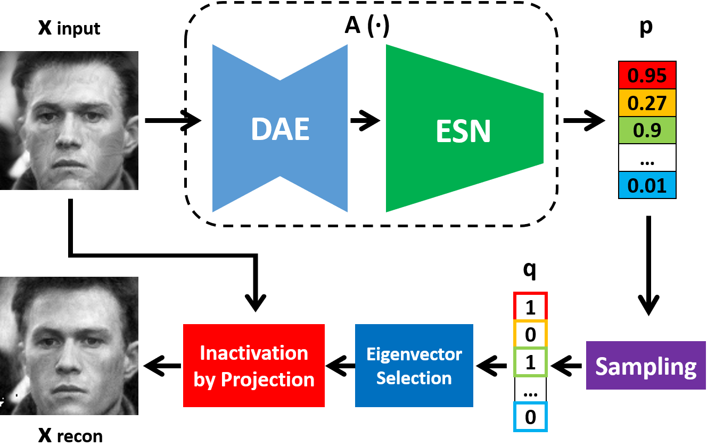
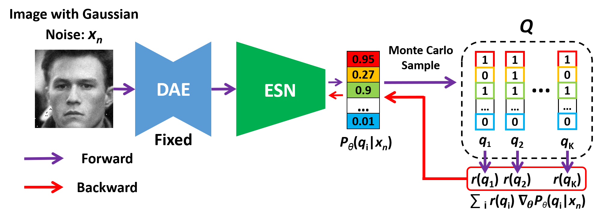

# Perturbation-Inactivate
This is the official implement for T-IFS paper [《Perturbation Inactivation Based Adversarial Defense for Face Recognition》](https://arxiv.org/abs/2207.06035)

We propose a plug-and-play adversarial defense method, named perturbation inactivation (PIN), to inactivate adversarial perturbations for adversarial defense. We discover that the perturbations in different subspaces have different influences on the recognition model.  There should be a subspace, called the immune space, in which the perturbations have fewer adverse impacts on the recognition model than in other subspaces. Hence, our method estimates the immune space and inactivates the adversarial perturbations by restricting them to this subspace. The proposed method can be generalized to unseen adversarial perturbations since it does not rely on a specific kind of adversarial attack method.

## The proposed framework

# Usage Instructions

## Requirments

python == 3.7

pytorch == 1.1.0

torchvision == 0.3.0

## Training

`config_train.py`to set the configurations of training.

`train.py` to begin training.

## Feature extraction

Pretrained model can be downloaded from [Baidu Netdisk](https://pan.baidu.com/s/1dvoVddvsow1D2p8JD0rW1g), code: 64u0

`config_test.py`to set the configurations of feature extraction.

`feature_extraction.py` to extract features.

# Citation
If you find **PIN** useful in your research, please consider to cite:

    @article{ren2022perturbation,
      title={Perturbation Inactivation Based Adversarial Defense for Face Recognition},
      author={Ren, Min and Zhu, Yuhao and Wang, Yunlong and Sun, Zhenan},
      journal={IEEE Transactions on Information Forensics and Security},
      year={2022},
      doi={10.1109/TIFS.2022.3195384}
    }

